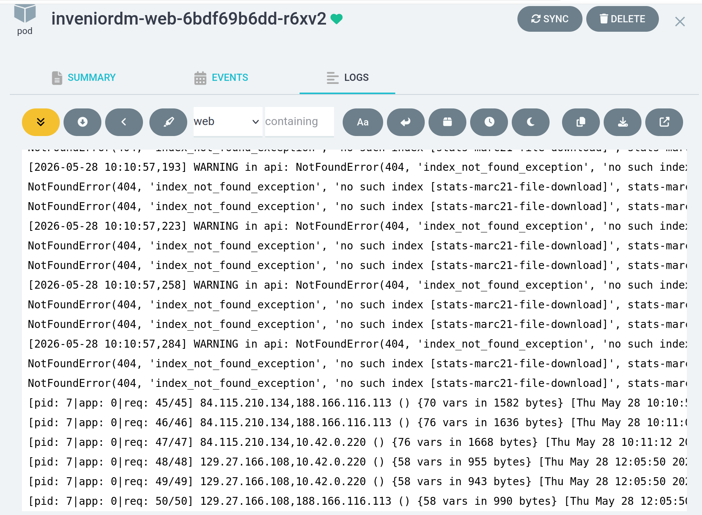
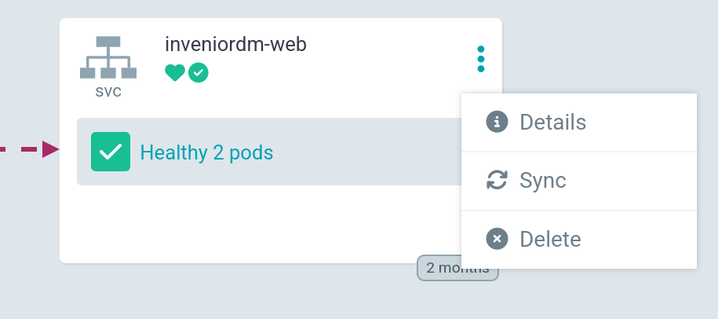

# TU Graz invenioRDM Deployment
## Main services

There are 3 main software application that need to be configured and deployed in order to run an invenioRDM instance.

* **[uWSGI](https://uwsgi-docs.readthedocs.io/en/latest/WSGIquickstart.html)**
is a software application that "aims at developing a full stack for building hosting services".
uwsgi (all lowercase) is the native binary protocol that uWSGI uses to communicate with other servers.

* **[Celery](https://docs.celeryproject.org/en/stable/userguide/application.html)**
is asynchronous task queue or job queue which is based on distributed message passing. While it supports scheduling, its focus is on operations in real time.

Alongside our base image, we are also pushing a [NGINX](https://gitlab.tugraz.at/invenio/nginx) container as a front-end proxy.

* **[Nginx](https://nginx.org/en/docs/)**
is a web server that can also be used as a reverse proxy, load balancer, mail proxy and HTTP cache. 

## Helm chart

Helm charts are packaged applications and resources designed to be deployed on Kubernetes.

The source of the Kubernetes deployment is the official invenioRDM [helm chart](https://github.com/inveniosoftware/helm-invenio). The chart is a template that contains all the necessary Kubernetes resources, like Services, Ingress, Secrets etc. 

For the deployment, we will have a look at the `values.yaml` file, which contains configuration values that will overwrite the default ones provided by the official chart.

### Resources

**Image**

We need to set the image of the [repository](https://gitlab.tugraz.at/invenio/repository) that we want to deploy.

```
image:
  registry: registry-example
  repository: repo
  tag: "main"
  pullPolicy: Always
```

### Invenio configuration

Override known invenio options.

``` 
invenio:
  hostname: "your_host.tugraz.at"
  init: false
  demo_data: false
  extraEnvVars:
    - name: INVENIO_ACCOUNTS_LOCAL_LOGIN_ENABLED
      value: "True"
``` 

### Ingress

Configure the ingress for users to access the hostname.

```
ingress:
  enabled: true
  class: "contour"
  tlsSecretNameOverride: ""
  path: /
  pathType: Prefix
  hosts:
    - your_host.tugraz.at
  tls: []
``` 

### RabbitMQ

TODO

### PostgreSQL

TODO


### Web, Worker, Worker Beat

Configure the resources, security context and other options for the main pods of invenioRDM

```
web:
  replicas: 2
  resources:
    requests:
      cpu: 500m
      memory: 750Mi
    limits:
      cpu: 1000m
      memory: 1Gi
  uwsgi:
    processes: 1
    threads: 2
  assets:
    location: /opt/invenio/var/instance/static

worker:
  enabled: true
  replicas: 2
  resources:
    requests:
      cpu: 500m
      memory: 512Mi
    limits:
      cpu: 2
      memory: 2Gi

workerBeat:
  resources:
    requests:
      cpu: 50m
      memory: 512Mi
    limits:
      cpu: 500m
      memory: 2Gi
```

### Persistence

TODO

### Other services

The deployment starts other services like: Redis, Opensearch, Flower, Haproxy.


## Vault
TODO

## Argocd

The helm chart can be deployed manually by accessing the Kubernetes cluster with [helm commands](https://helm.sh/docs/helm/).

The preferred way is to use the [ArgoCD tool](https://argo-cd.readthedocs.io/en/stable/).

### Create the app
Please refer to [this documentation](https://github.com/tugraz-rdm/argocd-deployments/tree/main/helm/inveniordm) for information of invenioRDM app.

### Logs
Once the app is created, the user can see the resources structure and even access the logs of the pods, as in this screenshot.



### Sync, Refresh
For the usecase of overridden values.yaml **Auto Sync** option does not work. If there are some changes in the `values.yaml` file, the repository admin needs to click on `Hard Refresh` in order for ArgoCD to detect and update the resources affected by the changes in the chart.



In case we want to redeploy the same image tag, but there is a new digest build, we need to either **Restart** or **Delete** the Web and Worker pods. Kubernetes will immediately try and create new ones and it will take the latest image digest.
